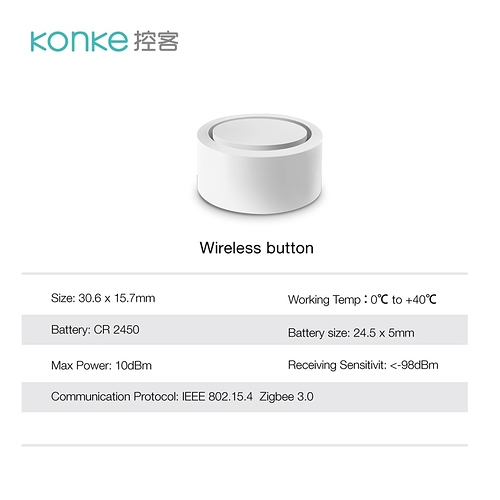
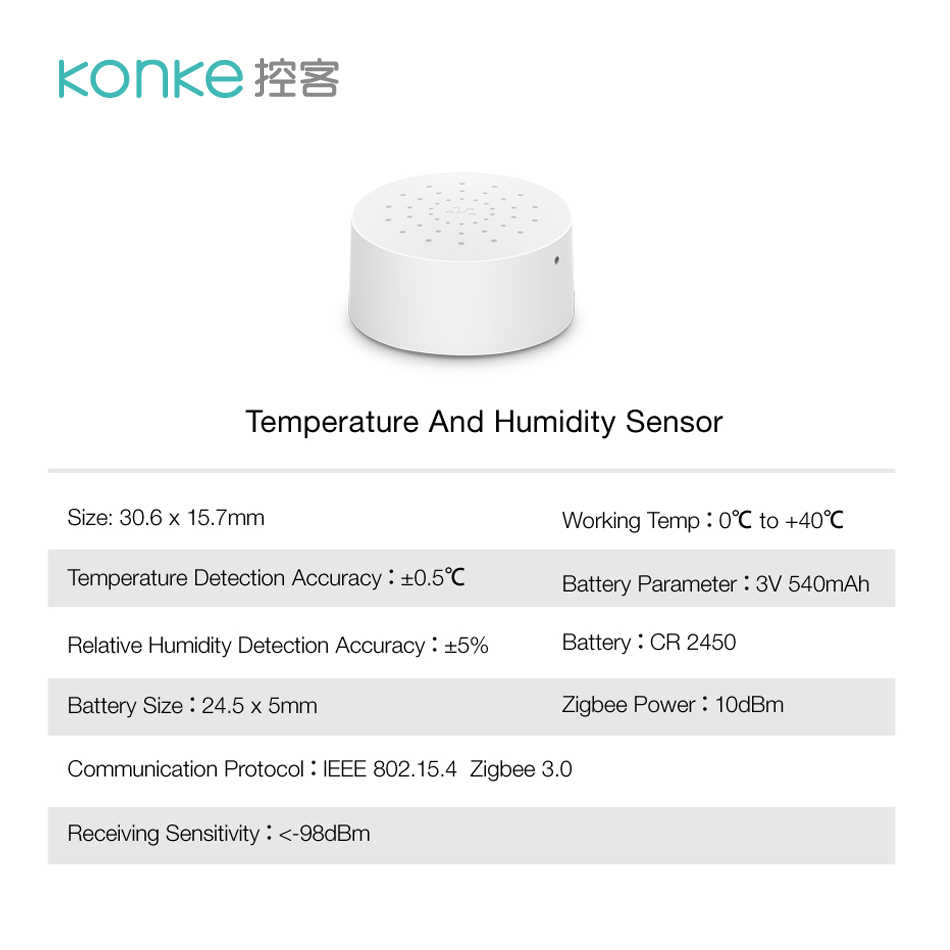
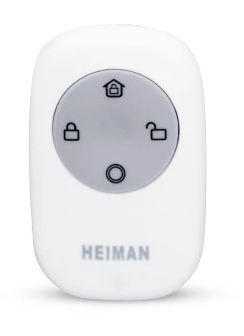

# Custom Apps for Hubitat

* [Scene Switch](apps/scene-switch) - use one switch to toggle scenes
* [Master Switch](apps/master-switch) - use one master switch to control multiple linked switches
* [Light Flasher](apps/light-flasher) - make lights flash

# Custom Drivers for Hubitat

* [Tasmota Switch](drivers/tasmota-mqtt-switch.groovy) - control Tasmota Switch via MQTT. 
* [Mitsumishi Air Conditioner](drivers/mitsubishi-ac-mqtt.groovy) - control [Mitsumishi Air Conditioner with ESP8266](https://github.com/SwiCago/HeatPump) via MQTT.
* [MiLight RGBW Remote Control (ESP8266 Hub)](drivers/milight-mqtt-rgbw-remote.groovy) - control MiLight lights with RGBW remote using [ESP8266 Hub](https://github.com/sidoh/esp8266_milight_hub) via MQTT.
* [WLED Light](drivers/wled-light.groovy) - control WLED light via MQTT. 
* [Konke Zigbee Button](drivers/konke-zigbee-button.groovy) - this driver has been in use since 24 of August 2019 with not a single issue noticed. 
* [Konke Zigbee Temperature Humidity Sensor](drivers/konke-zigbee-temp-humidity-sensor.groovy) 
* [Heiman Zigbee Key Fob](drivers/heiman-zigbee-key-fob.groovy) - also know as "Heiman Smart Remote Controller" .